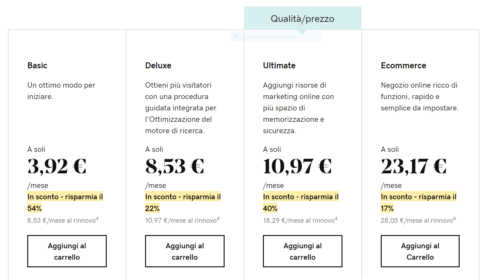

__[GoDaddy](http://www.kqzyfj.com/click-9182915-11478147) è uno dei player più famosi sul mercato degli hosting WordPress__ (e non solo). Cosa rende così tanto di successo questo hosting per WordPress?
 
 
**Scopriamolo insieme!** 
 

## Hosting WordPress GoDaddy: il nostro giudizio in breve

Come avrai avuto modo di leggere dalla nostra recensione breve che puoi trovare in [home](/), il nostro giudizio __sui servizi di hosting WordPress offerti da GoDaddy__ è sicuramente positivo, sebbene ci siano alcune piccole lacune del servizio clienti che lo rendono una scelta comunque ottima, ma forse un gradino inferiore, almeno da questo punto di vista, rispetto a SiteGround.

In ogni caso, come potremmo parlare male di un __host che ci garantisce un uptime del 99.97%?__ Certo, è leggermente più lento di SiteGround (è il nostro benchmark), più lento di circa 300 ms, ma questo non rappresenta di certo un problema insormontabile!  

## Hosting WordPress GoDaddy: chi sono e da dove vengono?  

### Chi sono i signori di GoDaddy?

 
GoDaddy nasce nel 1997 da una costola, se così possiamo dire, di Jomax Technologies (nome decisamente più anonimo) e nel corso di questo oltre venti anni di attività è diventato un gigante del web hosting in generale, con oltre 17 milioni di clienti.
  

Numeri che, davvero, non lasciano dubbi sulla qualità dei [servizi offerti da GoDaddy](http://www.kqzyfj.com/click-9182915-11478147); pertanto, non ci resta altro da fare che andare a fondo e scoprire insieme quali sono questi servizi di che tanto piacciono al pubblico di tutto il mondo!  

## Hosting WordPress GoDaddy: uptime e velocità

Come è nostra abitudine, non ci stancheremo mai di ricordarti cosa e perché guardare nella scelta di un hosting WordPress. Proprio per questo, torniamo a sottolineare quanto sia importante dare sempre un’occhiata ai dati di uptime e velocità di caricamento delle pagine.
  
Ad oggi, mentre stiamo stendendo questo articolo (che non mancheremo di aggiornare, sia chiaro), __l’uptime di GoDaddy nell’ultimo anno è stato del 99.97%__.
Perché devi sempre tenere sotto controllo questo parametro? Perché se il tuo sito sarà offilne per troppo tempo, allora non avrai modo di carpire e fidelizzare i clienti e perché chiunque entri su un sito trovandolo offline inizierà a nutrire dubbi sulla sua affidabilità.
  
Per quanto riguarda la velocità di __caricamento delle pagine,__ invece, nell’ultimo anno __GoDaddy ha decisamente migliorato le sue performance,__ assestandosi attorno ad un valore medio di 392 ms, un valore di assoluto rispetto e valore.
  
Anche in questo caso, stiamo parlando di un parametro che è assolutamente necessario monitorare e che è bene avere al top: è provato che siti lenti peggiorano l’esperienza utente, perdendo clienti e opportunità di crescita!  

## Hosting WordPress GoDaddy: analisi dell’offerta

### Cosa offre GoDaddy ai suoi clienti?

 
L’offerta di __GoDaddy è articolata in ben 4 piani,__ ahinoi non propriamente economici.
  
__È bene precisare che, per tutti i piani, [GoDaddy offre i seguenti servizi](http://www.kqzyfj.com/click-9182915-11478147):__
  
* 99,9% di tempo di attività garantito e garanzia "soddisfatti o rimborsati"
* Assistenza gratuita
* Aggiornamenti automatici software e della sicurezza di base di WordPress
* Strumento di migrazione con un solo clic
* Accesso a migliaia temi e plug-in gratuiti
* Per i principianti. Siti predefiniti ed editor delle pagine con trascinamento
* Ultima versione aggiornata di PHP 7
* Accesso SFTP (solo piani Deluxe e Ultimate).
* Email di Microsoft Office 365 gratuita per un anno con l'acquisto del piano annuale
* Nome di dominio temporaneo
  

In cosa consiste la garanzia “soddisfatti o rimborsati”? La __garanzia offerta da GoDaddy__ vale per 24h nel caso di acquisto di piano mensile e per 30 giorni nel caso di acquisto di piano annuale; consiste nel rimborso della quota pagata nel caso in cui si rilevi un mancato rispetto dei tempi di uptime garantiti!
  
### Andiamo ora a vedere, invece, in cosa consistono i diversi piani!
 

__Piano Basic:__ ad un prezzo di 3,92€/mese GoDaddy ti mette a disposizione quanto segue
  
* La possibilità di mettere online un sito web, con dominio gratuito nel caso di acquisto del piano annuale!
* 30 GB di spazio di memorizzazione
* Un host che ti consentirà di gestire fino a ben 25000 utenti al mese!
* Backup quotidiani gratuiti con ripristino in 1 clic
* Scansioni antimalware automatiche
* Moduli di iscrizione incorporati di Gravity Forms
  

Se sei interessato al Piano Basic, lo trovi [qui](http://www.kqzyfj.com/click-9182915-11478147).
  

Passiamo ora al __Piano Deluxe__, che invece comprende le seguenti feature (in aggiunta a quelle del Basic), al prezzo di 8,53€/mese:
  
* 75 GB di spazio di archiviazione
* Dominio gratuito
* Garanzia di sito up fino a 100000 utenti al mese
* Procedura guidata SEO integrata
* Sito di testing con un clic
  

Se sei interessato al Piano Deluxe, lo trovi [qui](http://www.kqzyfj.com/click-9182915-11478147).
  

Il __Piano Ultimate__, invece, viene presentato dalla stessa GoDaddy come il migliore per rapporto qualità/prezzo, offrendo, in più rispetto ai due piani precedenti, quanto segue:
  
* 1 sito web
* Dominio gratuito
* Spazio di memorizzazione illimitato
* Garanzia di sito up con visitatori illimitati mensilmente
* Sito di testing un clic
* Certificato SSL gratuito (per il 1° anno)
  

Se sei interessato al Piano Ultimate, lo trovi [qui](http://www.kqzyfj.com/click-9182915-11478147).
  

Infine, passiamo ora al piano più costoso, il __Ecommerce__; cosa ti offre questo servizio, al costo non certamente modico di 23,17€/mese? Scopriamolo:
  

* 1 sito web
* Dominio gratuito
* Spazio di memorizzazione illimitato
* Garanzia di sito up con visitatori illimitati mensilmente
* Sito di testing in 1 clic
* Certificato SSL
* Nessuna commissione per le transazioni
* Prodotti illimitati
* Prenotazione e pianificazione di appuntamenti
* Tariffe di spedizione in tempo reale
* Accesso gratuito alle migliori estensioni premium di [WooCommerce](https://woocommerce.com/)
  

Insomma, sicuramente un piano di tutto rispetto per il tuo eCommerce!
  

Se ti interessa il Piano Ecommerce, lo trovi [qui](http://www.kqzyfj.com/click-9182915-11478147).
  

I dati che ti abbiamo messo a disposizione sono tanti e certamente non è facilissimo scegliere il piano migliore. Chiaramente, __devi partire dalle tue esigenze__: se stai iniziano ora ad addentrarti nel mondo dei siti web e di quelli creati con WordPress in particolare, __ti consigliamo di partire con il piano Deluxe__, un po’ più costoso del Basic, ma in grado di offrire maggiore supporto in termini SEO, caratteristica sicuramente non trascurabile per chi è al lancio.
  

## Hosting WordPress GoDaddy: giudizio sul servizio clienti

Come si è comportato il servizio clienti di GoDaddy con noi?
Nel complesso, bene.
  

Abbiamo avuto modo di testare sia la live chat sia il numero verde, entrambi operativi dalle 9 alle 19, dal lunedì al venerdì.
  

Nel complesso, l’esperienza si è rivelata assolutamente positiva, grazie a cordialità, gentilezza e competenza degli operatori.
  

L’unica pecca è l’assenza di un servizio operativo h24 7/7, ma si può in parte sorvolare su questo grazie all’elevato livello di competenza degli operatori.
  

## Hosting WordPress GoDaddy: è sicuro?

Cosa fa GoDaddy per la sicurezza del tuo sito web?
__GoDaddy offre i certificati SSL a partire da 5,80€ per il primo anno e da 85,39€ a partire dagli anni successivi al primo (oppure gratuitamente con i pacchetti più costosi).__ Inoltre, garantisce un servizio di backup del tuo sito web che ti permetterà di dormire sonni tranquilli, non perdendo la tua presenza online anche in caso di attacchi hacker.
  

Molto spesso i piccoli imprenditori non si preoccupano di questo aspetto, ma è fondamentale, poiché il sito web è un vero e proprio investimento che può garantire un ritorno molto, molto elevato: per questo motivo è fondamentale proteggerlo nel migliore dei modi!
  

## Hosting WordPress GoDaddy: il nostro giudizio finale

Quindi, ti consiglieremmo [GoDaddy](http://www.kqzyfj.com/click-9182915-11478147)?
  

__Assolutamente si!__
  

__La nostra personale esperienza si è rivelata più che positiva,__ con tempi di caricamento attorno ai 400 ms (quindi al top tra i servizi di hosting), uptime del 99,97% e servizio clienti che, sebbene non sia operativo sempre, si è rivelato davvero utile, cordiale ed efficace!
  

Insomma, c’è poco da aggiungere: stiamo parlando di uno dei migliori player del mercato di hosting wordpress!
